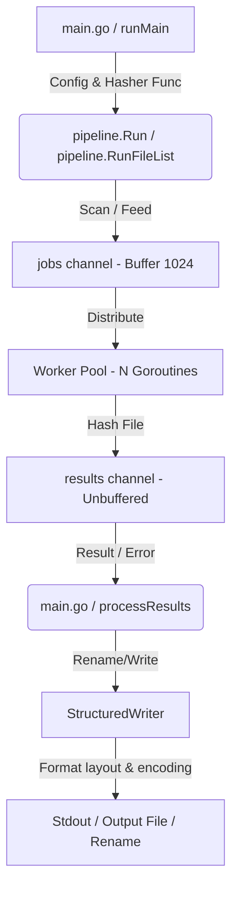
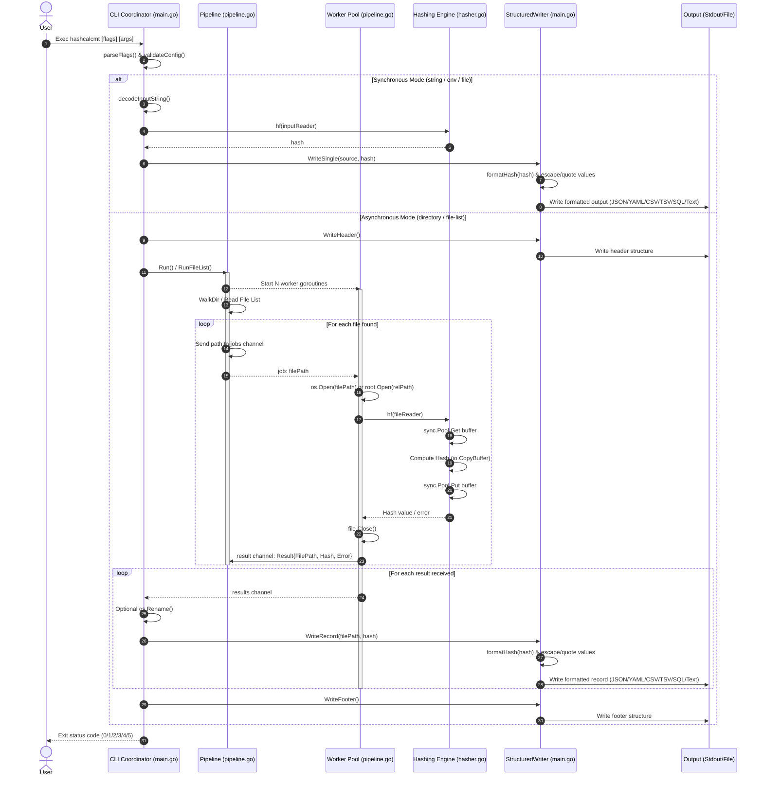

# Hash MT Generator

## Overview and Objectives

The **Hash MT Generator** (`hashcalcmt`) is a high-performance, concurrent command-line utility written in Go. Its primary objective is to calculate cryptographic and non-cryptographic hashes of files, strings, environment variables, and file lists.

The utility is designed to address the following objectives:
1.  **High Throughput**: Utilize parallel processing across multiple CPU cores to maximize I/O and hashing performance, leveraging Go's native concurrency primitives.
2.  **Safety and Sandboxing**: Enforce file scanning limits using secure directory-sandboxing mechanisms to prevent path-traversal attacks.
3.  **Low Resource Overhead**: Maintain an O(1) constant memory footprint when processing large files and millions of directory entries.
4.  **Operational Versatility**: Provide five processing modes (directory, string, environment, file, file-list) and support standard input/output redirection.

---

## Architecture and Design Choices

The application is structured into three decoupled layers:
1.  **CLI Coordinator** ([main.go](./main.go)): Orchestrates CLI flag parsing, validates configuration constraints, and formats/streams final outputs.
2.  **Concurrent Pipeline** ([pipeline/pipeline.go](./pipeline/pipeline.go)): Manages a worker pool that consumes hashing tasks concurrently.
3.  **Hashing Engine** ([hasher/hasher.go](./hasher/hasher.go)): Provides standard wrappers and custom codecs for 25 different hashing algorithms.

### System Architecture Diagram



### Design Assumptions
*   **Concurrency Limits**: It is assumed that the underlying disk subsystem can handle concurrent read requests efficiently. For NVMe SSDs, scalability scales linearly with the CPU core count. For seek-heavy spinning HDDs, single-threaded execution is recommended to prevent head thrashing.
*   **Operating System Uniformity**: File operations use the standard Go `os` library to abstract file manipulation across Linux and Windows environments.

### Edge Case Handling
*   **Empty Files**: Hashing an empty file returns the corresponding hashing algorithm's default empty state value rather than failing.
*   **Directory Access in File Lists**: If a path in a file list points to a directory, the system captures the open error cleanly via the results channel and continues processing subsequent items.
*   **Windows Sharing Locks**: Open file handles are closed immediately after hashing, allowing renaming operations to proceed without sharing violation errors on Windows.
*   **Renaming Conflicts**: The utility inspects destination paths using `os.Stat` before executing renames, preventing silent data overwrites.

### Performance and Efficiency Optimizations
*   **Buffer Pooling**: Utilizes a `sync.Pool` of pre-allocated 128KB byte slices for file read operations. This bypasses GC allocation churn, reducing memory overhead to O(1) constant space.
*   **Large Chunk Reads**: The 128KB read buffer size reduces file-read system call frequency by 4x compared to Go's default 32KB buffer, maximizing NVMe read throughput.
*   **Writer Buffering**: Disk output writes are buffered via `bufio.Writer` to minimize the performance penalty of frequent tiny disk writes.

---

## Data Flow and Control Logic

### Operational Flow and Code Relations
*   `main.go` parses flags into a `Config` struct and invokes `validateConfig` to ensure flag compatibility.
*   The hashing function is initialized by passing the selected algorithm name string to `hasher.GetHasher()`.
*   `runMain` calls `executeMode` which determines the execution route based on the selected mode:
    *   `directory` and `file-list` modes delegate job scheduling to the concurrent workers in `pipeline.go`.
    *   `string`, `environment`, and `file` modes execute synchronously within the coordinator loop.
*   `processResults` consumes from the results channel until closed, executing renames and streaming output.

### Sequence Diagram



---

## Dependencies

### Compiler Requirements
*   **Go Version**: Go 1.26+ (specifically utilizes `os.OpenRoot` sandboxing features introduced in Go 1.24+).

### Standard Library Packages
*   `bufio`, `flag`, `fmt`, `io`, `os`, `path/filepath`, `runtime`, `strings`, `sync`, `crypto/md5`, `crypto/sha1`, `crypto/sha256`, `crypto/sha512`, `hash/adler32`, `hash/crc32`, `hash/crc64`, `hash/fnv`.

### Third-Party Libraries
*   `github.com/cespare/xxhash/v2` (xxHash 64-bit implementation)
*   `github.com/pierrec/xxHash/xxHash32` (xxHash 32-bit implementation)
*   `github.com/zeebo/xxh3` (XXH3 fast 64-bit and 128-bit implementations)
*   `github.com/zeebo/blake3` (BLAKE3 parallel implementation)
*   `github.com/minio/highwayhash` (HighwayHash cryptographic checksum)
*   `github.com/orisano/wyhash` (Wyhash ultra-fast implementation)
*   `github.com/htruong/go-md2` (MD2 implementation)
*   `golang.org/x/crypto/blake2b` (BLAKE2b implementation)
*   `golang.org/x/crypto/blake2s` (BLAKE2s implementation)
*   `golang.org/x/crypto/sha3` (SHA3 NIST family standard implementation)
*   `github.com/tjfoc/gmsm/sm3` (SM3 Chinese national standard cryptographic hash implementation)

---

## Security Assessment

*   **Encryption in Transit**: Not applicable. `hashcalcmt` is a local filesystem utility. It contains no network-layer packages and performs no network communication.
*   **Secret Management**: The application does not store, cache, or transmit secrets. When hashing environment variables (`--mode=environment`), values are read strictly in-memory using `os.LookupEnv` and processed as transient streams.
*   **Authentication & Access Control**: The application relies on the host operating system's security architecture. File read, write, and rename operations run within the execution context of the user running the process. No internal RBAC or privilege management is implemented.
*   **Directory Traversal Sandboxing**: In directory scanning mode, directories are accessed via `os.OpenRoot(path)`. Paths discovered during traversal are resolved relative to the root using `filepath.Rel` and opened via `root.Open(relPath)`. This prevents directory traversal attacks, restricting file access to the designated directory tree even when symlinks are present.
*   **Unprivileged Context**: The utility does not require administrator (Windows) or root (Linux) privileges and is designed to run within unprivileged user environments.
*   **Supply Chain Security**: All third-party dependencies are pinned to specific versions in the `go.mod` file and verified using `go.sum` hashes to prevent tampering.

---

## Code Quality Assessment

*   **Concurrency Safety**: Hashing pipelines are verified using Go's race detector (`go test -race ./...`) to ensure that all data transfers across channels are synchronized and race-free.
*   **Modularity**: Code is structured into isolated packages (`hasher`, `pipeline`, `codec/blake2sp`). Hashing algorithms implement a unified `hasher.Func` interface, facilitating unit test mocking and extension.
*   **Resource Integrity**: All resource-allocating calls (`os.Open`, `os.Create`) are paired with matching defer or explicit close routines to prevent resource leaks.

---

## Command Line Arguments

The application is configured using the following CLI flags:

| Flag | Type | Default Value | Description |
| :--- | :--- | :--- | :--- |
| `--mode` | `string` | `directory` | Operating mode: `string`, `environment`, `file`, `file-list`, or `directory`. |
| `--file-pattern` | `string` | `*` | Glob pattern to filter files. (Only used in `directory` mode). |
| `--path` | `string` | `.` | Target folder path to traverse. (Only used in `directory` mode). |
| `--hash` | `string` | `MD5` | Hashing algorithm to use. Supports 31 algorithms (e.g., `SHA256`, `BLAKE3`, `XXH3-128`, `SM3`). |
| `--out-file` | `string` | (none) | Path to write hashing output results. |
| `--rename` | `bool` | `false` | Rename files in-place to their calculated hash values. (Only used in `file` and `directory` modes). |
| `--display` | `bool` | `true` | Print output results directly to the console. |
| `--workers` | `int` | (CPU Count) | Number of parallel worker threads in the pipeline. |
| `--version` | `bool` | `false` | Display version information and exit. |
| `--input-encoding` | `string` | `utf8` | Input string preprocessing encoding: `utf8`, `utf16le`, `utf16be`, `hex`, `base64`, or `base64url` (Only for `string` and `environment` modes). |
| `--output-format` | `string` | `hex` | Output hash formatting: `hex`, `hex-upper`, `base64`, `base64url`, or `raw`. |
| `--format` | `string` | `text` | Output structure layout format: `text`, `json`, `yaml`, `csv`, `tsv`, or `sql`. |

---

## Exit Codes

The application returns granular exit codes to support diagnostic integration in automation scripts:

| Code | Diagnostic Meaning | Description |
| :--- | :--- | :--- |
| **`0`** | **Success** | Hashing operations completed successfully. |
| **`1`** | **Execution Failure** | General I/O errors, file-read errors, or fatal stream processing failures. |
| **`2`** | **Configuration Error** | Invalid flags, invalid mode argument, or flag conflicts. |
| **`3`** | **Partial Hashing Failure** | Pipeline finished, but some target files failed to open or hash. |
| **`4`** | **Output File Write Failure** | Could not create or flush the results file to disk. |
| **`5`** | **Rename Conflict Error** | Renaming aborted because a file with the destination hash name already exists. |

---

## Detailed Examples

### 1. Directory Scanning Mode (Default)
Recursively scan and calculate the SHA256 hashes of all `.txt` files in the current folder (explicit mode configuration shown):
```bash
./hashcalcmt --mode=directory --hash=SHA256 --file-pattern="*.txt"
```
**Sample Output:**
```text
notes.txt: a25d194c64bdc9f584a991b89fddaa5754ed1cc96d6d42445338669c1305df12
todo.txt: 4ca8bbd3c595ee306226c6996b32b8d47a900217c55a7ed0cfc868ee444f34f1
```

### 2. Hashing a Raw String
Calculate the MD5 hash of a raw string:
```bash
./hashcalcmt --mode=string --hash=MD5 "test-string"
```
**Sample Output:**
```text
6613d789052028682054238e83344605
```

### 3. Piping Input via Standard Input (Stdin)
Hash a piped string or stream binary data directly into the tool:
```bash
echo -n "user-credentials" | ./hashcalcmt --mode=string --hash=BLAKE3
```
**Sample Output:**
```text
56525164ef1a8d07010471b058a9e7cd82c1618a8b1ecf8ee3d0cf339e802521
```

### 4. Hashing a Single File
Calculate the XXH3-128 hash of a single file:
```bash
./hashcalcmt --mode=file --hash=XXH3-128 /var/log/syslog
```
**Sample Output:**
```text
/var/log/syslog: df8e932b1a8d07e1a3b04c8f96e2a7b8
```

### 5. Hashing a List of Specific Files
Concurrently calculate hashes of files specified in a line-delimited list file:
```bash
./hashcalcmt --mode=file-list --hash=SHA256 /opt/manifest.txt
```
**Sample Output:**
```text
/opt/data1.bin: a1d96c601b14efcf8e3de3d0cf339e8025217f5dbe86fbe397f3227eaa106d90
/opt/data2.bin: c538b66c7110ca3a028ccfe422d0f1fa200a99352cf24dba5fb0a30e26e83b2a
```

### 6. Hashing with Input Encoding and Output Formatting
Calculate the NTLM-compatible MD4 hash of a password (which requires UTF-16LE input encoding) and output it in uppercase hex format:
```bash
./hashcalcmt --mode=string --hash=MD4 --input-encoding=utf16le --output-format=hex-upper "password"
```
**Sample Output:**
```text
8846F7EAEE8FB117AD06BDD830B7586C
```

Calculate the SHA256 hash of a base64-encoded string (`YWJj` which decodes to `abc`), and output the result in URL-safe Base64:
```bash
./hashcalcmt --mode=string --hash=SHA256 --input-encoding=base64 --output-format=base64url "YWJj"
```
**Sample Output:**
```text
ungWv48Bz-pBQUDeXa4iI7ADYaOWF3qctBD_YfIAFa0
```

### 7. Hashing with Structured Layout Output Format
Recursively scan a directory and output the SHA256 hashes of all `.json` files in structured YAML format:
```bash
./hashcalcmt --mode=directory --hash=SHA256 --file-pattern="*.json" --format=yaml
```
**Sample Output:**
```yaml
- file_path: "config.json"
  hash: "e3b0c44298fc1c149afbf4c8996fb92427ae41e4649b934ca495991b7852b855"
- file_path: "package.json"
  hash: "a25d194c64bdc9f584a991b89fddaa5754ed1cc96d6d42445338669c1305df12"
```

Scan and output results in CSV format, saving the output directly to a file:
```bash
./hashcalcmt --mode=directory --hash=SHA256 --format=csv --out-file=checksums.csv
```
**Contents of `checksums.csv`:**
```csv
file_path,hash
config.json,e3b0c44298fc1c149afbf4c8996fb92427ae41e4649b934ca495991b7852b855
package.json,a25d194c64bdc9f584a991b89fddaa5754ed1cc96d6d42445338669c1305df12
```

Generate SQL insert scripts and pipe them directly into SQLite to populate a database table:
```bash
./hashcalcmt --mode=directory --hash=SHA256 --format=sql | sqlite3 integrity.db
```
**Piped SQL Statements:**
```sql
CREATE TABLE IF NOT EXISTS hashes (file_path TEXT, hash TEXT);
BEGIN TRANSACTION;
INSERT INTO hashes (file_path, hash) VALUES ('config.json', 'e3b0c44298fc1c149afbf4c8996fb92427ae41e4649b934ca495991b7852b855');
INSERT INTO hashes (file_path, hash) VALUES ('package.json', 'a25d194c64bdc9f584a991b89fddaa5754ed1cc96d6d42445338669c1305df12');
COMMIT;
```

### 8. Token and Legacy Protocol Integrations (JWT, API Keys, NTLM)

**NTLM Password Hash Generation (UTF-16LE Input + MD4 + Hex-Upper Output)**:
Calculate the legacy Windows NTLM-compatible hash of a user's password string:
```bash
./hashcalcmt --mode=string --hash=MD4 --input-encoding=utf16le --output-format=hex-upper "password"
```
**Sample Output:**
```text
8846F7EAEE8FB117AD06BDD830B7586C
```

**JSON Web Token (JWT) Segment Decoding (Base64Url Input + Raw Output)**:
Decode the Base64Url-encoded payload of a JWT token string directly back to plain JSON on the CLI:
```bash
./hashcalcmt --mode=string --input-encoding=base64url --output-format=raw "eyJzdWIiOiIxMjM0NTY3ODkwIiwibmFtZSI6IkpvaG4gRG9lIiwiaWF0IjoxNTE2MjM5MDIyfQ"
```
**Sample Output:**
```json
{"sub":"1234567890","name":"John Doe","iat":1516239022}
```

**JSON Web Token (JWT) Signature Formatting (Hex Input + Base64Url Output)**:
Transcode a raw hex signature string into the standard padding-free URL-safe Base64 format required for a JWT signature block:
```bash
./hashcalcmt --mode=string --input-encoding=hex --output-format=base64url "ba7816bf8f01cfea414140de5dae2223b00361a396177a9cb410ff61f20015ad"
```
**Sample Output:**
```text
ungWv48Bz-pBQUDeXa4iI7ADYaOWF3qctBD_YfIAFa0
```

**Secure API Bearer Token Database Lookup Hashing (Base64Url Input + SHA256 + Hex Output)**:
Compute the SHA256 database lookup hash from an incoming Base64Url-encoded client bearer token:
```bash
./hashcalcmt --mode=string --hash=SHA256 --input-encoding=base64url --output-format=hex "client_token_xyz"
```

### 9. Real-World DevOps & Infrastructure Pipelines

**GitOps Config Rollouts (Auto-triggering Kubernetes rollouts)**:
Calculate the SHA256 of a configuration file and inject it as a template annotation in a deployment manifest to trigger rolling updates when changes occur:
```bash
CONFIG_HASH=$(./hashcalcmt --mode=file --hash=SHA256 --output-format=hex config.yaml)
sed -i "s/config-checksum: .*/config-checksum: \"${CONFIG_HASH}\"/" deployment.yaml
```

**Scanning & Identifying Duplicate Files (Fast CSV processing)**:
Scan a directory using the ultra-fast `XXH3-128` algorithm (18.95 GB/s), write results in CSV, and filter duplicates using `awk`:
```bash
./hashcalcmt --mode=directory --hash=XXH3-128 --format=csv --out-file=manifest.csv
awk -F, 'count[$2]++ {print "Duplicate file path: " $1} {paths[$2]=$1}' manifest.csv
```

**Piping Streaming Downloads On-The-Fly (Zero disk-write hashing)**:
Stream download an ISO file using standard input (`-`) to compute its SHA256 checksum on-the-fly without saving the file to disk first:
```bash
curl -sL "https://releases.ubuntu.com/24.04/ubuntu-24.04-live-server-amd64.iso" | ./hashcalcmt --mode=file --hash=SHA256 -
```

**Integrity Verification of a Live Kubernetes Secret**:
Verify if a base64-encoded Kubernetes secret matches a target local hash without writing plaintext values to logs or storage:
```bash
kubectl get secret database-creds -o jsonpath='{.data.password}' | ./hashcalcmt --mode=string --input-encoding=base64 --hash=SHA256
```

**Forensic Malware / File Search (Identifying compromised system binaries)**:
Concurrently scan a system folder using MD5 and filter results to identify files matching a known malicious indicator of compromise (IOC) hash:
```bash
./hashcalcmt --mode=directory --hash=MD5 --format=csv --path=/usr/bin | grep "8846f7eaee8fb117ad06bdd830b7586c"
```

**Multi-Segment Backup Verification (Validating split database dumps)**:
Concurrently calculate the SHA256 hashes of multiple database dump segments listed in a text file and output them as a tab-separated values (TSV) manifest:
```bash
./hashcalcmt --mode=file-list --hash=SHA256 --format=tsv --out-file=backup_checksums.tsv segment_list.txt
```

**Directory Synchronization Auditing (Post-Migration Verification)**:
Generate TSV hash manifests of a source and destination directory using the ultra-fast `XXH3-128` algorithm, then run a diff to verify that all file data matches:
```bash
# On Server A (Source):
./hashcalcmt --mode=directory --hash=XXH3-128 --format=tsv --out-file=source_manifest.tsv

# On Server B (Destination):
./hashcalcmt --mode=directory --hash=XXH3-128 --format=tsv --out-file=dest_manifest.tsv

# Compare the manifests:
diff source_manifest.tsv dest_manifest.tsv
```

**Intrusion Detection & File System Integrity Monitoring (Tripwire-Style)**:
Establish a trusted baseline hash manifest of critical system folders, and periodically compare it against daily scans to detect unauthorized file creations, deletions, or modifications:
```bash
# 1. Establish trusted baseline:
./hashcalcmt --mode=directory --hash=SHA256 --format=csv --path=/etc --out-file=/root/etc_baseline.csv

# 2. Run periodic scan (e.g., daily cron):
./hashcalcmt --mode=directory --hash=SHA256 --format=csv --path=/etc --out-file=/tmp/etc_daily.csv

# 3. Detect changes:
diff /root/etc_baseline.csv /tmp/etc_daily.csv
```

**Content-Addressable Storage (CAS) & Static Asset Cache Busting**:
Concurrently rename all static assets in a build directory to their content-addressable SHA256 hashes in-place to prevent browser caching issues:
```bash
./hashcalcmt --mode=directory --hash=SHA256 --file-pattern="*.js" --rename
```

## Hashing Algorithm Reference

The following tables list all 31 supported hashing algorithms, grouped by main category of usage, showing their primary purpose and a computed example hash (of the string `"1.0.0\n"`):

### 1. High-Performance Non-Cryptographic Checksums / Fast Hashes

These algorithms are designed for extreme speed, cache efficiency, and hash table mappings. They do not provide cryptographic security against collision attacks.

| Algorithm | Primary Usage | Output Size | Example Hash (for `"1.0.0\n"`) |
| :--- | :--- | :--- | :--- |
| **`ADLER32`** | zlib, PNG, and RFC 1950 data transmission checksum validation. | 32-bit (8 hex chars) | `03c600f8` |
| **`CRC32`** | Ethernet, SATA, ZIP, and PNG data integrity validation. | 32-bit (8 hex chars) | `fd7ea868` |
| **`CRC64`** | ISO checksums, database indexing, and hardware integrity. | 64-bit (16 hex chars) | `6132c1f2c1f32000` |
| **`FNV32A`** | Hash tables, unique key mappings, and indexing. | 32-bit (8 hex chars) | `cfa89a92` |
| **`FNV64A`** | Quick hash tables and string de-duplication. | 64-bit (16 hex chars) | `880cd925fe68c272` |
| **`FNV128A`** | Extended hash tables and collision-free fast mapping. | 128-bit (32 hex chars) | `2c7e31c05a3c64bf6e6a2ea75e526aba` |
| **`XXH32`** | High-speed 32-bit hashing for hash tables on 32-bit CPUs. | 32-bit (8 hex chars) | `a1ccd1bd` |
| **`XXH64`** | High-speed 64-bit hashing for hash tables on 64-bit CPUs. | 64-bit (16 hex chars) | `bab1a35d4a4787be` |
| **`XXH3-64`** | Next-gen xxHash optimized for vector instructions. | 64-bit (16 hex chars) | `fdcff0777522f8f2` |
| **`XXH3-128`** | Ultra-fast 128-bit de-duplication and memory hashing. | 128-bit (32 hex chars) | `99bb5e782cb9700575d5add4d0993c4f` |
| **`HIGHWAYHASH`**| Cryptographically strong keyed checksum / PRF for hash tables. | 128-bit (32 hex chars) | `17c352b5db8e8a44261d2f12d7b25a28` |
| **`WYHASH`** | High-performance, low-state hashing for general usage. | 64-bit (16 hex chars) | `d2e0e598baa371d4` |

### 2. Modern Secure Cryptographic Hashes

These algorithms are designed to prevent preimage and collision attacks, making them suitable for digital signatures, secure storage, and authentication.

| Algorithm | Primary Usage | Output Size | Example Hash (for `"1.0.0\n"`) |
| :--- | :--- | :--- | :--- |
| **`SHA256`** | TLS, code signing, Bitcoin blockchain, and standard security baseline. | 256-bit (64 hex chars) | `59854984853104df5c353e2f681a15fc7924742f9a2e468c29af248dce45ce03` |
| **`SHA384`** | Suite B cryptography, secure government document signing. | 384-bit (96 hex chars) | `8224a0ea9e28732dcdf5bd8d86b1bfd6950ba504de4ae85f67bb556ad352ab2489374faafbda94e5710c0ef2c47881ce` |
| **`SHA512`** | High-security signatures and file hashing on 64-bit systems. | 512-bit (128 hex chars) | `c6e5081ce77f5971474ff994acc1b8887818f3007a4e3db32c91640203906f0bd2df3012441c9e1b6c1ae4e54dfea465ec23034092779cf6852aece45bf1df21` |
| **`SHA512-224`** | Truncated SHA-512 to prevent length extension attacks. | 224-bit (56 hex chars) | `cc56d85702b9f68cb870007835653b165e445197cd91871e27964ab5` |
| **`SHA512-256`** | Truncated SHA-512 to prevent length extension attacks. | 256-bit (64 hex chars) | `cfdfa621322f73df85392d216d83517bead3afd1af6655861d5614d9b7652b2a` |
| **`SHA3-224`** | Keccak-based NIST standard for secure message digest. | 224-bit (56 hex chars) | `07338bbadcaf99bd2496179817a308645b1e758ea1c3122f40240508` |
| **`SHA3-256`** | Keccak-based NIST standard for secure message digest. | 256-bit (64 hex chars) | `48e4e254588d057b4fb679f36e6299c5061a7826ac586a8354a8fdd0083312cd` |
| **`SHA3-384`** | Keccak-based NIST standard for secure message digest. | 384-bit (96 hex chars) | `99b9d6ef85880c3c47580db63d7a4faf9da3288af5fedf32622809890398b6b018f0799b119a86e9cd09e8846e59bfc4` |
| **`SHA3-512`** | Keccak-based NIST standard for secure message digest. | 512-bit (128 hex chars) | `b3238614b3880765cb112793f8e345d8ea8c87421defd6167af6edc9425cb7d5cc7279c27c27de918b7598fe79c7a27c11e84c9ea1960571299937453e71d276` |
| **`BLAKE2S`** | High-performance 256-bit hash optimized for 8/16/32-bit systems. | 256-bit (64 hex chars) | `c5d24b89c99b28cb9c7aa4317a909ae22973239f6db5be6b15e44c6c83d29f7e` |
| **`BLAKE2B`** | High-performance 512-bit hash optimized for 64-bit systems. | 512-bit (128 hex chars) | `7f4c5b00f6fdbb9cbd2dfa312d34accb351d835bdcbba542f66821965ad6e7d891cf8cfbfeccc77596a499daf1229e321ad7adaf0ef013e4770bc262a9771581` |
| **`BLAKE2SP`** | Parallel 8-way tree-hashing BLAKE2s variant. | 256-bit (64 hex chars) | `e96d378bc9a8b71a3f5b63c6e87dfcd60300d18ccf814bd48c8dc418741bda2b` |
| **`BLAKE3`** | State-of-the-art secure and highly parallelizable cryptographic hash. | 256-bit (64 hex chars) | `7f5dbe86fbe397f3227eaa106d90587f6d6afe43e2110b498bdb3f043cc08e6b` |
| **`SM3`** | Chinese national commercial cryptography hashing standard. | 256-bit (64 hex chars) | `2999fb87b08cf0743e86876df6300c2f679550b3989d3d0f9bc6d57fa8328235` |

### 3. Legacy Cryptographic Hashes

These algorithms are vulnerable to collision attacks and must be used strictly for compatibility checks against older systems.

| Algorithm | Primary Usage | Output Size | Example Hash (for `"1.0.0\n"`) |
| :--- | :--- | :--- | :--- |
| **`MD2`** | Legacy X.509 certificate and PEM messaging checks. | 128-bit (32 hex chars) | `e7f7569dfd2eb6cae21d5cc29e0a1ddf` |
| **`MD4`** | Legacy Windows NT domain authentication (NTLM; note that NTLM hash calculation requires pre-converting input strings to UTF-16LE). | 128-bit (32 hex chars) | `616b57c3480305f696d388a791c86f4a` |
| **`MD5`** | Legacy file integrity checking, rsynced backups. | 128-bit (32 hex chars) | `c9e47dbb0e1927076ed7b2e1ec157be7` |
| **`SHA1`** | Git object references, legacy SSL/TLS certificate compatibility. | 160-bit (40 hex chars) | `c538b66c7110ca3a028ccfe422d0f1fa200a9935` |
| **`RIPEMD160`**| Blockchain ledger systems, Bitcoin addresses, PGP keys. | 160-bit (40 hex chars) | `ea48e575d8638b9903ca1cc27346201182edd3a9` |

---

## Performance Benchmarks & Selection Guide

Below are the measured single-core throughput results for **all 31 supported algorithms** in `hashcalcmt` (benchmarked on an Intel Core i5-4590 CPU @ 3.30GHz):

| Algorithm | Single-Core Throughput | Type | Best Use Case |
| :--- | :--- | :--- | :--- |
| **`XXH3-128`** | **18.95 GB/s** | Non-Cryptographic | **Maximum Performance** (de-duplication, fast integrity checks) |
| **`XXH3-64`** | **18.92 GB/s** | Non-Cryptographic | Alternate ultra-fast 64-bit non-cryptographic hash |
| **`HIGHWAYHASH`**| **10.61 GB/s** | Non-Cryptographic | Cryptographically strong keyed checksum |
| **`XXH64`** | **10.09 GB/s** | Non-Cryptographic | High performance 64-bit hash |
| **`CRC32`** | **8.13 GB/s** | Non-Cryptographic | Traditional legacy Ethernet/ZIP checksumming |
| **`XXH32`** | **5.07 GB/s** | Non-Cryptographic | Standard 32-bit hash on older architectures |
| **`WYHASH`** | **4.74 GB/s** | Non-Cryptographic | Ultra-fast simple hash |
| **`BLAKE3`** | **2.28 GB/s** | Cryptographic | **Maximum Performance Cryptographic Hashing** |
| **`ADLER32`** | **1.92 GB/s** | Non-Cryptographic | Fast Adler checksumming for network transfers (zlib) |
| **`CRC64`** | **1.13 GB/s** | Non-Cryptographic | Legacy 64-bit cyclic redundancy check |
| **`BLAKE2B`** | **669.63 MB/s**| Cryptographic | Highly optimized cryptographic hashing for 64-bit CPUs |
| **`FNV64A`** | **658.55 MB/s**| Non-Cryptographic | Fast FNV-1a 64-bit hashing |
| **`SHA1`** | **657.22 MB/s**| Cryptographic | Legacy Git object tracking/references |
| **`FNV32A`** | **615.25 MB/s**| Non-Cryptographic | Fast FNV-1a 32-bit hashing |
| **`MD5`** | **563.57 MB/s**| Cryptographic | Legacy verification (checksum validation) |
| **`SHA512-224`** | **413.68 MB/s**| Cryptographic | SHA-512 truncated for 224-bit hashes |
| **`SHA512-256`** | **409.99 MB/s**| Cryptographic | SHA-512 truncated for 256-bit hashes |
| **`SHA512`** | **407.83 MB/s**| Cryptographic | Standard high-bit-depth secure hash |
| **`SHA384`** | **406.40 MB/s**| Cryptographic | SHA-2 secure hash variant |
| **`BLAKE2s`** | **383.53 MB/s**| Cryptographic | Standard sequential hash optimized for 8/16/32-bit CPUs |
| **`BLAKE2sp`** | **342.04 MB/s**| Cryptographic | Parallel variant (tree-hashing structure) |
| **`MD4`** | **318.45 MB/s**| Cryptographic | Legacy Windows NTLM authentication compatibility |
| **`SHA256`** | **272.87 MB/s**| Cryptographic | Standard baseline security (TLS certificates) |
| **`FNV128A`** | **259.29 MB/s**| Non-Cryptographic | FNV-1a 128-bit hash variant |
| **`SHA3-224`** | **240.18 MB/s**| Cryptographic | Modern SHA-3 (Keccak) variant |
| **`SHA3-256`** | **227.13 MB/s**| Cryptographic | Modern SHA-3 baseline security |
| **`SHA3-384`** | **175.40 MB/s**| Cryptographic | Modern SHA-3 variant |
| **`RIPEMD160`**| **129.33 MB/s**| Cryptographic | Legacy Bitcoin address generation and PGP |
| **`SHA3-512`** | **116.18 MB/s**| Cryptographic | Maximum bit-depth SHA-3 secure hash |
| **`SM3`** | **95.32 MB/s** | Cryptographic | China National Standard cryptographic baseline |
| **`MD2`** | **5.95 MB/s**  | Cryptographic | Deprecated RSA legacy hashing standard |

### How to Run Benchmark Tests

To execute performance and allocation benchmarks on your local system:

*   **Bash / Unix Shell**:
    ```bash
    # Navigate to the hasher package directory
    cd hasher

    # Run only the complete 31-algorithm benchmark suite
    go test -bench=BenchmarkAllAlgorithms -run="^$"
    ```

*   **PowerShell (Windows)**:
    ```powershell
    # Navigate to the hasher package directory
    cd hasher

    # Run only the complete 31-algorithm benchmark suite (with quoted arguments)
    go test "-bench=BenchmarkAllAlgorithms" -run="^$"
    ```

### Hashing Selection Guidelines
1. **For Max Performance (Non-Cryptographic)**:
   * **Use `--hash=XXH3-128`**. At **18.95 GB/s**, this is fully CPU-efficient and will effortlessly saturate the fastest PCIe NVMe SSDs.
2. **For Max Performance (Cryptographic)**:
   * **Use `--hash=BLAKE3`**. At **2.28 GB/s** per core, it is **8x faster** than SHA-256 and will easily saturate disk I/O when scaled concurrently across multiple workers.
3. **Storage Limitations**:
   * If hashing files on a standard SATA SSD (max ~550 MB/s), **BLAKE3**, **XXH3-128**, **CRC32**, **Wyhash**, and **HighwayHash** will all cap out at maximum disk read speeds.
   * On spinning HDDs (max ~150 MB/s), any algorithm is disk-bound. Under such constraints, using `--hash=XXH3-128` keeps CPU usage near 0%.

---

## Test Suite Documentation

### Logic Flow
The test suite validates components using both unit and integration execution strategies. It asserts correct routing, error propagation, safety checks, and data compliance across different architectures.

### Detailed Test Cases

| Test Function | Target Component | Description / Purpose | Expected PASS Result | Expected FAIL Result |
| :--- | :--- | :--- | :--- | :--- |
| `TestParseFlags` | Flag Parser | Verifies CLI flags parse into Config correctly. | Config fields match input arguments. | Parser panics or returns mismatched values. |
| `TestValidateConfig` | Config Validator | Tests config validation rules (such as mode-exclusive checks). | Invalid flag combinations return errors. | Invalid configurations are accepted as nil error. |
| `TestProcessResults_ErrorsAndRenames` | Results Handler | Verifies error handling and rename-in-place behaviors. | Successful renames occur; conflicts return errors. | Data is overwritten or failures crash the loop. |
| `TestExecuteMode_Directory` | Traversal Mode | Runs directory walking and verifies relative paths. | Hashes matching files inside the folder. | Traversal goes out of bounds or skips files. |
| `TestExecuteMode_String` | String Hashing | Verifies raw string hashing. | Outputs exact hash of target string. | Hashing returns incorrect checksum. |
| `TestExecuteMode_StringStdin` | Stdin Piping | Verifies piping string data into stdin. | Processes stream and calculates hash. | Stream is corrupted or program hangs. |
| `TestExecuteMode_Environment` | Env Hashing | Verifies environment variable hashing. | Fetches env var and calculates hash. | Fails if env var is missing or returns wrong hash. |
| `TestExecuteMode_File` | File Hashing | Tests file hashing and rename-in-place logic. | File is hashed and renamed cleanly. | Rename lock violations or read failures occur. |
| `TestExecuteMode_FileList` | File List Mode | Tests concurrent list hashing and comments filtering. | Ignores comments and hashes files concurrently. | Comment lines trigger read errors. |
| `TestRunMain_Integration` | CLI Coordinator | Asserts version checks, validation codes, and exit codes. | Returns correct granular exit codes (0/1/2/4). | Returns generic code 1 or crashes. |

### Running the Test Suite
To run the entire test suite including the race detector, execute the following command in the workspace directory:
```bash
go test -v -race -cover -count=1 ./...
```

---

## Compilation and Deployment

`hashcalcmt` is compiled from source using the standard Go toolchain. Since the project utilizes Go 1.26+ features, ensure your local Go toolchain is up-to-date.

### Local Compilation

To compile a production-ready, stripped executable for the host platform:

```bash
go build -ldflags="-s -w" -o hashcalcmt main.go
```
* The `-ldflags="-s -w"` option strips debugging information and symbols, reducing the binary size by approximately 30%.

### Cross-Compilation

Go supports cross-compilation out-of-the-box. To build binaries for target operating systems without external dependencies:

```bash
# Target Linux 64-bit Architecture
GOOS=linux GOARCH=amd64 go build -ldflags="-s -w" -o hashcalcmt main.go

# Target Windows 64-bit Architecture
GOOS=windows GOARCH=amd64 go build -ldflags="-s -w" -o hashcalcmt.exe main.go
```

---

## Cryptographic Security Warnings

> [!WARNING]
> Hashing algorithms classified under the **Legacy Cryptographic Hashes** section (specifically **`MD2`**, **`MD4`**, **`MD5`**, and **`SHA1`**) have known cryptographic vulnerabilities and are susceptible to collision attacks. These algorithms are provided strictly for legacy compatibility verification and data integrity checks against older systems. **Do not use MD2, MD4, MD5, or SHA-1 for security-sensitive operations such as password hashing, signatures, or cryptographic access tokens.** For secure cryptographic operations, select **`BLAKE3`** or **`SHA256`**.
